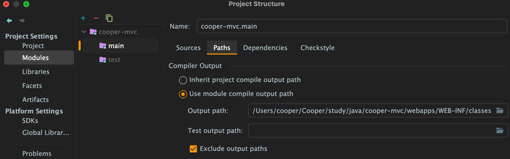
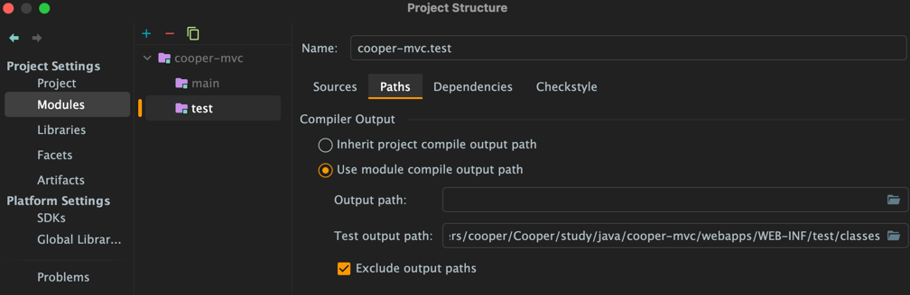

## 1. project setup

### (1) build.gradle

```groovy
dependencies {
    implementation 'org.apache.tomcat.embed:tomcat-embed-core:8.5.42'
    implementation 'org.apache.tomcat.embed:tomcat-embed-jasper:8.5.42'
}
```

### (2) 프로젝트 루트에 webapps 추가

```text
.
├── build.gradle
├── gradle
├── gradlew
├── gradlew.bat
├── settings.gradle
├── src
└── webapps

```

### (3) source code

```java
import java.io.File;

import org.apache.catalina.startup.Tomcat;
import org.slf4j.Logger;
import org.slf4j.LoggerFactory;

public class WebApplicationServer {

	private static final Logger logger = LoggerFactory.getLogger(WebApplicationServer.class);

	public static void main(String[] args) throws Exception {
		final String webappDirLocation = "webapps/";
		final Tomcat tomcat = new Tomcat();
		tomcat.setPort(8080);

		tomcat.addWebapp("/", new File(webappDirLocation).getAbsolutePath());
		logger.info("configure app with base dir : {}", new File("./" + webappDirLocation).getAbsolutePath());

		tomcat.start();
		tomcat.getServer().await();
	}
}
```

### (3) configure classes file path




