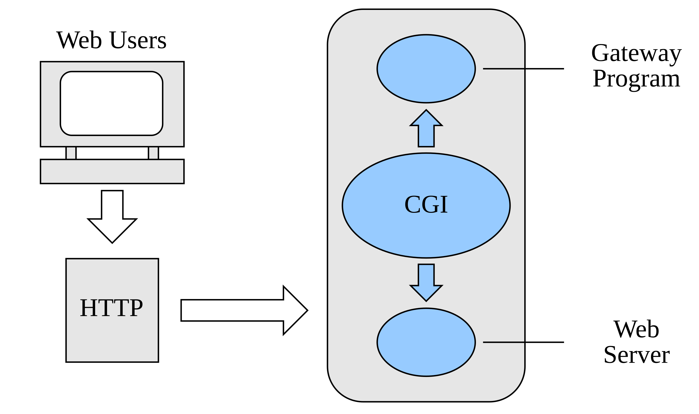
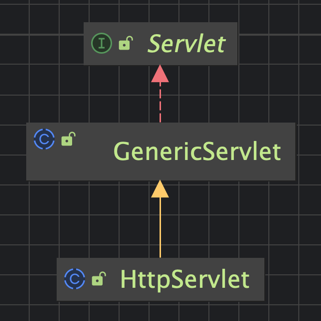
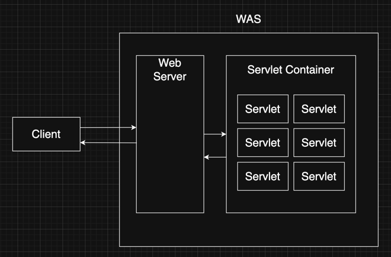

## 1. cooper mvc servlet

### (1) CGI (Common Gateway Interface)

1. 웹 서버와 애플리케이션 사이에 주고받는 규약이며, **동적 프로그래밍을 지원**하기 위한 방법이다.
2. CGI 규칙에 의해 만들어진 프로그램을 CGI 프로그램이라 한다.
   - 종류로는 컴파일 방식(C, C++, Java), 인터프리터 방식(PHP, Python) 등이 있다.
   - 예시 : Java Servlet

 

#### reference

- [[wikipedia kr] 공용 게이트웨이 인터페이스](https://ko.wikipedia.org/wiki/%EA%B3%B5%EC%9A%A9_%EA%B2%8C%EC%9D%B4%ED%8A%B8%EC%9B%A8%EC%9D%B4_%EC%9D%B8%ED%84%B0%ED%8E%98%EC%9D%B4%EC%8A%A4)

### (2) servlet 

1. 자바를 사용해 동적인 웹페이지를 제공하기 위한 표준이다.
2. 실제 비즈니스 로직은 Servlet interface 의 구현체를 통해 입력해야 한다.
3. 생명 주기 관련 메서드 : init(), service(), destroy()
4. 환경 설정 메서드 : getServletConfig(), getServletInfo()
5. Servlet TMI
   - init(), destroy() 메서드를 생략하고 싶다면 `GenericServlet` 사용할 것
   - HTTP 에 관한 servlet 을 관리할 경우, `HttpServlet` 을 사용할 것

### (3) servlet container

1. servlet 의 라이프 사이클을 관리하는 컨테이너이다.
2. servlet container 에서는 웹 서버와 소켓을 만들고 통신하는 과정을 대신해준다. (그러므로 개발자는 비즈니스 로직에 집중하면 된다.)
3. 해당 요청에 알맞는 서블릿 인스턴스가 힙 메모리에 존재하는지 확인하여 반환한다.
   - 만약 서블릿이 존재하지 않을 경우, `init()` 메서드를 통해 서블릿을 생성한다.
4. servlet 객체는 일반적으로 싱글톤(singleton) 으로 관리된다.
   - stateful 한 설계를 하면 안됀다. (for thread safety)

### (4) WAS vs Servlet Container??

1. was 는 servlet container 를 포괄하는 개념이다.
2. was 는 thread pool 에서 기존 스레드를 사용한다.

### servlet container 와 spring container 의 차이는??

#### reference

- [ServletContainer 와 SpringContainer는 무엇이 다른가?](https://sigridjin.medium.com/servletcontainer%EC%99%80-springcontainer%EB%8A%94-%EB%AC%B4%EC%97%87%EC%9D%B4-%EB%8B%A4%EB%A5%B8%EA%B0%80-626d27a80fe5)

