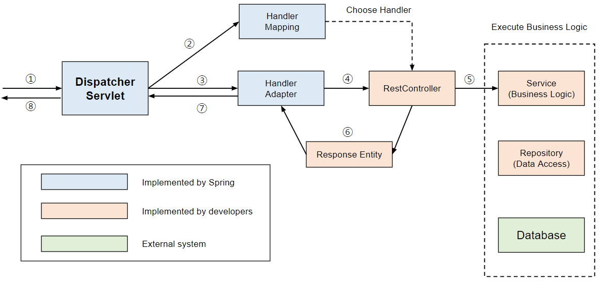

# FrontController Pattern

## (1) FrontController Pattern ??

1. 모든 요청을 단일 handler(처리기) 에서 처리하도록 하는 패턴
2. DispatcherServlet 이 FrontController 패턴으로 구현되어 있음.

[출처 : [망나니 개발자] [Spring] Dispatcher-Servlet(디스패처 서블릿)이란? 디스패처 서블릿의 개념과 동작 과정](https://mangkyu.tistory.com/18)

