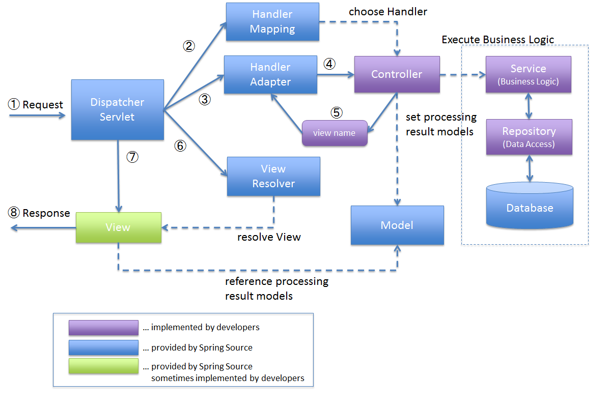

# spring mvc

### (1) spring mvc architecture

1. DispatcherServlet 이 요청을 받는다.
2. DispatcherServlet 은 적절한 컨트롤러를 선택하는 작업을 HandlerMapping 에 위임한다.
3. HandlerMapping 은 들어온 요청 URL 과 매핑된 컨트롤러를 선택하고, 선택된 핸들러(컨트롤러)를 DispatcherServlet 에 반환한다.
4. DispatcherServlet 은 컨트롤러의 비즈니스 로직 실행 작업을 HandlerAdapter에 위임한다.
5. HandlerAdapter 는 컨트롤러의 비즈니스 로직 처리를 호출한다.
6. 컨트롤러는 비즈니스 로직을 실행하고, 처리 결과를 Model에 설정한 후 View의 논리적 이름을 HandlerAdapter 에 반환한다.
7. DispatcherServlet 은 View 이름에 해당하는 View 를 찾는 작업을 ViewResolver 에 위임한다.
8. ViewResolver 는 View 이름에 매핑된 View 를 반환한다.
9. DispatcherServlet 은 반환된 View 에 렌더링 작업을 위임한다.
10. View 는 Model 데이터를 렌더링하여 응답을 반환한다.

### (2) 컴포넌트 별로 구분하기

|          컴포넌트          | 역할 설명 |
|:----------------------:|-----------|
| **DispatcherServlet**  | 프론트 컨트롤러로, 클라이언트의 모든 요청을 가장 먼저 받아 처리 흐름을 제어함 |
|   **HandlerMapping**   | 요청 URL에 적절한 컨트롤러(Handler)를 매핑하여 선택함 |
|   **HandlerAdapter**   | 선택된 컨트롤러를 실행할 수 있도록 호출을 처리함 (컨트롤러 호출을 돕는 어댑터) |
|     **Controller**     | 비즈니스 로직을 처리하고, 처리 결과를 Model에 저장하며, View의 논리 이름을 반환함 |
|       **Model**        | 컨트롤러에서 생성한 데이터(결과)를 담는 객체로, View에 전달됨 |
|    **ViewResolver**    | 논리적인 View 이름을 실제 View 객체로 변환함 (예: JSP, Thymeleaf 등) |
|        **View**        | Model 데이터를 기반으로 HTML 등을 렌더링하여 최종 응답을 생성함 |

### (3) HandlerMapping 비교

1. HandlerMapping List 에서 알맞는 HandlerMapping 조회
   1. `RequestMappingHandlerMapping` : HandlerKey(url, RequestMethod) 를 기반으로 해당 컨트롤러를 호출  
   2. `AnnotationHandlerMapping` : reflection 을 이용해서 @Controller 어노테이션에 선언된 객체들의 메서드를 호출해 @RequestMapping 에 선언된 부분의 값을 파악해 HandlerKey + AnnotationHandler 생성
2. HandlerAdapter List 에서 HandlerAdapter 조회
   1. `SimpleControllerHandlerAdapter` : 해당 controller 를 호출해서 해당 메서드 호출 
   2. `AnnotationHandlerAdapter` : reflection 을 통해 Controller 객체를 생성하고 해당 메서드를 호출하는 방식으로 동작 (스프링에서는 싱글톤인 부분은 조금 차이)
3. ModelAndView 호출 : HandlerAdapter 호출 결과로 viewName 전달
   - model 객체 : 의미가 불분명함 -> View 에서 getAttribute 로 호출 (실제 값을 주입 안됨)
4. ViewResolver 에서 viewName 에 알맞는 View 객체를 반환
5. View 종류
   - JspView : Jsp 페이지 전달 객체
   - RedirectView : 리다이렉션용 객체

## reference

- [Overview of Spring MVC Architecture](https://terasolunaorg.github.io/guideline/5.2.1.RELEASE/en/Overview/SpringMVCOverview.html)
